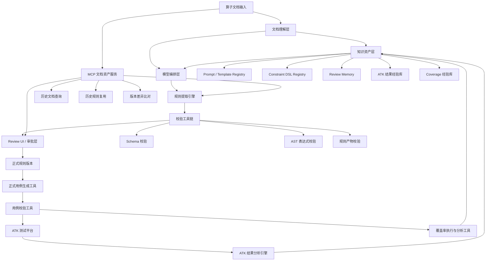
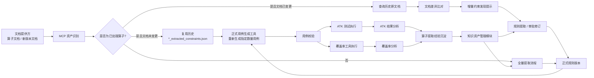
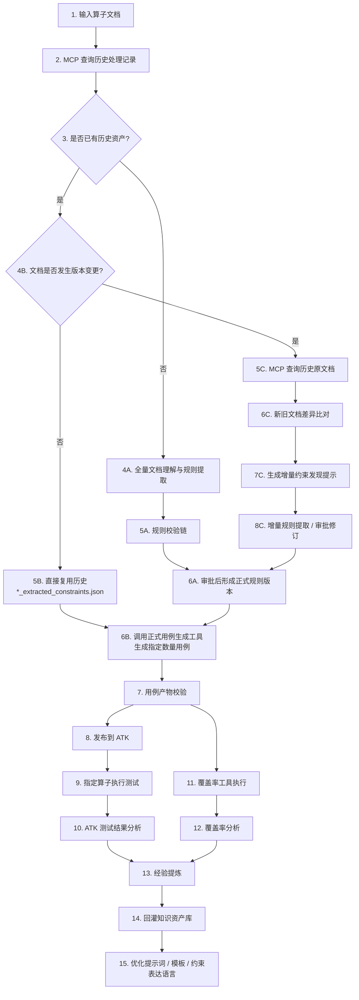

# 算子文档结构化抽取平台 V3 规划

> 形式建议：以下内容直接对应 3 页 PPT。  
> 基线关系：以 `doc_v2.md` 为基准，补充 `MCP 资产复用 / 文档版本比对 / ATK 结果分析 / 覆盖率反馈闭环` 四项增强能力。  
> 风格建议：以图为主，文字仅保留汇报口径与高层能力点。

---

## 第 1 页：项目架构

### 标题建议
**从规则工程平台升级为“可复用、可增量、可反馈进化”的测试生产平台**

### 汇报口径
V3 在 V2 基础上进一步引入 `MCP 文档资产服务`、`历史规则复用能力`、`版本差异分析能力`、`测试反馈知识回灌能力`，实现从文档输入到测试执行再到知识沉淀的全生命周期闭环。

### 页面要点

- V3 新增 `MCP 文档资产服务`，支持历史处理结果复用与文档版本差异分析。
- 测试平台不再是终点，`ATK 结果` 与 `覆盖率结果` 会反向回灌知识资产层，驱动提取质量持续优化。
- 平台能力从“生成”升级为“生成 + 复用 + 校验 + 执行 + 反馈进化”的闭环体系。

---

## 第 2 页：业务架构

### 标题建议
**构建“存量复用 + 增量发现 + 测试反馈回灌”的业务闭环**

### 汇报口径
V3 的业务架构引入两条核心增量能力：  
一条是 `MCP 驱动的存量资产复用与版本差异分析链路`，另一条是 `ATK/覆盖率结果驱动的经验沉淀链路`，从而实现规则生产平台的持续演进。

### 页面要点

- 对于已处理且未变更的算子，不再重复生成 `*_extracted_constraints.json`，直接复用历史规则资产并调用正式用例工具生成指定数量用例。
- 对于文档发生版本变更的算子，通过 MCP 查询历史原文档并执行差异比对，形成“需要补充哪些新增约束”的增量提示。
- `ATK 测试结果` 与 `覆盖率结果` 不再只是执行数据，而是反向沉淀为“算子提取经验”，持续提升后续抽取与生成质量。

---

## 第 3 页：核心流程图

### 标题建议
**端到端流程：MCP 复用、增量约束发现、ATK 与覆盖率反馈闭环**

### 汇报口径
V3 的核心流程从单一路径扩展为“复用路径 + 增量路径 + 全量路径”三种模式，并在测试执行后增加结果分析与经验回灌，实现真正的数据闭环与知识闭环。

### 页面要点

- V3 新增三种执行模式：`全量提取`、`历史规则复用`、`文档变更后的增量提取`。
- MCP 不仅用于文档读取，还用于历史原文档查询、规则资产复用与版本差异分析。
- 测试执行后的 `ATK 结果` 与 `覆盖率结果` 会进入统一经验提炼链路，反向优化提示词、模板与约束表达语言。

---

## 封底一句话

`V3` 的核心价值，是把平台从“规则生成与测试发布”进一步升级为一套**可复用、可增量、可分析、可自我进化**的算子规则与测试生产平台。
