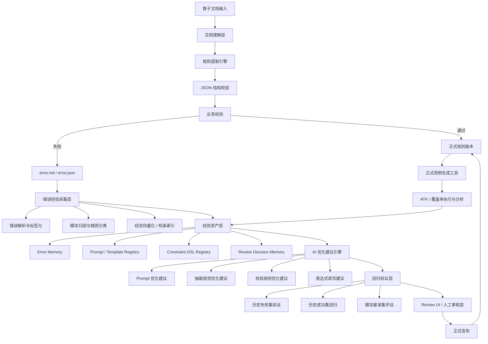
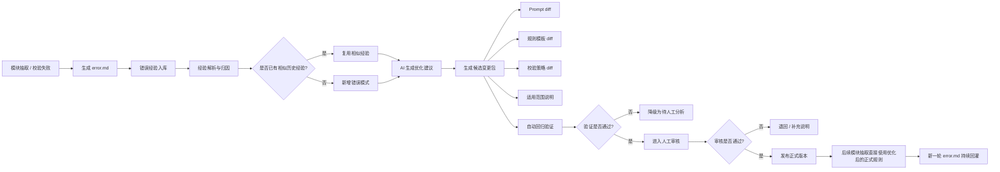
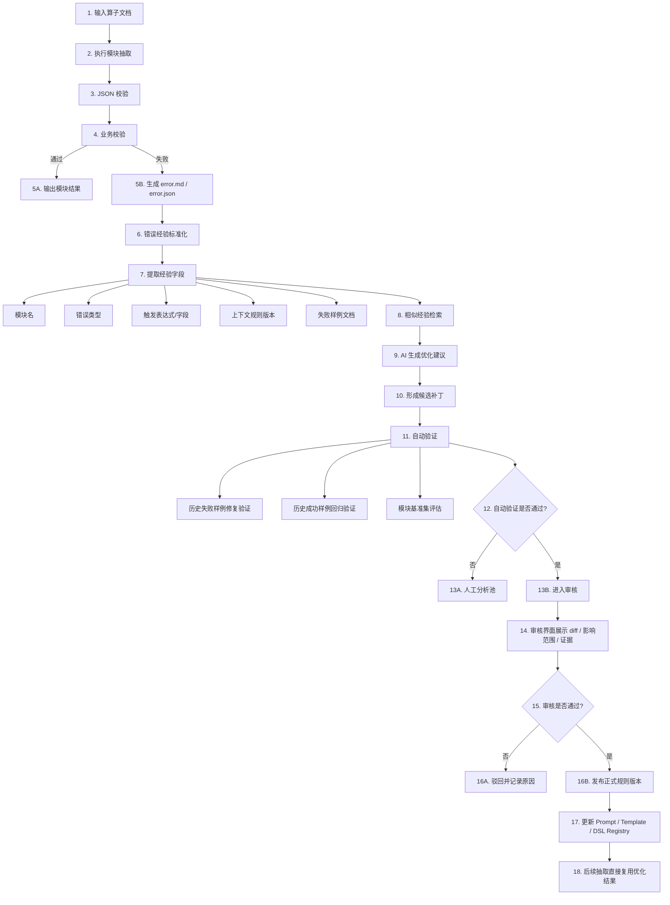

# 算子文档结构化抽取平台 V4 规划

> 形式建议：以下内容可直接对应 4 页 PPT。  
> 基线关系：以 `doc_v3.md` 为基础，重点新增 `error.md 经验沉淀 / AI 优化建议生成 / 人工审核发布 / 回归验证闭环` 四项能力。  
> 核心目标：把当前“抽取失败后仅保存 error.md”的模式，升级为“失败经验可沉淀、可检索、可优化、可审核发布”的人机协同进化平台。

---

## 第 1 页：项目架构升级

### 标题建议
**从“规则抽取平台 V3”升级为“基于 error.md 经验驱动的人机协同优化平台 V4”**

### 汇报口径
V4 在 V3 的 `MCP 资产复用 / 文档版本差异分析 / 测试反馈闭环` 基础上，进一步引入 `error.md 经验资产化`、`AI 优化建议生成`、`人工审核发布机制`、`回归验证与灰度发布`，实现“失败经验不丢失、优化建议可追溯、正式规则可控发布”的闭环。

### 页面要点

- V4 不再把 `error.md` 仅作为失败日志，而是作为结构化经验输入。
- AI 只负责“生成优化建议”，不直接改写正式规则，正式发布必须经过人工审核。
- 每次优化都要经过回归验证，避免“修复一个问题、引入一批回归”。

---

## 第 2 页：业务架构

### 标题建议
**构建“错误经验沉淀 -> AI 优化建议 -> 人工审核发布”的业务闭环**

### 汇报口径
V4 的核心业务变化，不只是“提取失败后重试”，而是把失败样本转化为长期可复用经验，让后续相似问题能够被更快识别、更准修复，并通过人工审核保障优化正确性与发布可控性。

### 页面要点

- `error.md` 应按模块、算子、错误类型、规则版本进行索引，而不是散落保存。
- AI 建议输出的应该是“候选变更包”，而不是直接覆盖原规则文件。
- 人工审核不是可选流程，而是正式发布前的强制门禁。

---

## 第 3 页：核心流程

### 标题建议
**端到端流程：从模块失败样本到正式优化发布**

### 汇报口径
V4 让每次失败都进入统一优化链路。失败样本先被标准化，再触发相似经验检索与 AI 建议生成，随后通过回归验证和人工审核，最终才进入正式资产库并影响后续抽取质量。

### 页面要点

- 自动验证是 AI 建议进入人工审核前的第一道门禁。
- 审核界面需要展示“原规则、建议 diff、适用范围、验证结果、历史证据”。
- 审核结论也应沉淀为经验，用于后续相似建议的优先级判断。

---

## 第 4 页：V4 落地建议

### 标题建议
**落地建议：先经验结构化，再 AI 优化，最后审核发布**

### 汇报口径
建议 V4 按“低风险、可回溯、可灰度”的方式推进，不建议直接让 AI 自动修改正式规则。最优路径是先把 `error.md` 做成结构化资产，再让 AI 生成建议，并用自动验证和人工审核形成双保险。

### 核心建议

#### 1. 不建议直接把原始 error.md 全量喂给 AI 进行正式规则改写

更推荐先做“经验结构化”，将 `error.md` 解析成标准经验卡片，例如：

- `module_name`
- `operator_name`
- `rule_version`
- `error_type`
- `error_path`
- `failed_field`
- `failed_expression`
- `root_cause_summary`
- `fix_suggestion`
- `evidence_docs`
- `review_status`

这样做的好处是：

- 经验可以检索和聚类
- 便于相似问题复用
- 可追踪每条经验来源与适用范围

#### 2. AI 输出应是“优化建议”，不是“正式结果”

建议 AI 输出内容至少包括：

- 建议修改哪个模块的哪个规则文件
- 修改前后 diff
- 修改原因
- 适用边界
- 潜在风险
- 推荐验证样本

这样审核人看到的是“可判断的变更建议”，而不是黑盒结果。

#### 3. 建议建立模块级基准集

每个模块至少维护三类样本：

- `历史失败样本集`
- `历史成功样本集`
- `高频算子代表样本集`

AI 生成的优化建议必须先跑这三类样本，只有通过后才进入人工审核。

#### 4. 建议把人工审核做成强制门禁

以下场景建议必须人工审核：

- Prompt 模板发生修改
- 校验规则发生修改
- 影响多个模块的公共规则发生修改
- 影响结构化 schema 或约束 DSL 的修改

审核界面最少应展示：

- 原规则与新规则 diff
- error.md 来源证据
- 自动验证结果
- 预计影响范围
- 发布版本号

#### 5. 建议引入“灰度发布 + 回滚”机制

不要让新经验一旦通过审核就全量生效，建议：

- 先在指定模块或指定算子集合上灰度
- 监控成功率、失败率、回归率
- 若异常则快速回滚到上一正式版本

#### 6. 建议把审核结果也纳入经验库

不仅失败的 `error.md` 要沉淀，人工审核的结论也要沉淀，例如：

- 为什么通过
- 为什么拒绝
- 哪类建议经常无效
- 哪类错误适合直接复用历史经验

这样可以逐渐形成“AI 建议质量评估能力”。

---

## 对当前项目的直接改造建议

结合当前项目现状，建议按以下顺序推进：

### 第一阶段：把 error.md 变成经验资产

- 统一收集各模块生成的 `error.md` 与 `error.json`
- 增加经验解析脚本，将错误信息结构化入库
- 建立按模块、错误类型、算子名的检索索引

### 第二阶段：引入 AI 优化建议生成

- 基于“当前规则 + 历史经验 + 当前失败样本”生成建议
- 输出候选补丁而不是直接改文件
- 给出风险和适用范围说明

### 第三阶段：引入自动验证

- 对建议补丁执行历史失败样本修复验证
- 对历史成功样本执行回归验证
- 将验证结果形成可审核报告

### 第四阶段：引入人工审核与正式发布

- 增加审核页面或最小化审核工作台
- 审核通过后生成正式版本
- 支持版本对比、灰度发布与回滚

### 第五阶段：与 V3 的 MCP / ATK / 覆盖率链路合并

- 将 `error.md` 经验库纳入知识资产层
- 将 ATK / 覆盖率反馈与模块 error 经验统一管理
- 最终形成统一的知识回灌闭环

---

## 封底一句话

`V4` 的核心价值，是把当前“失败后留下一份 error.md”的静态处理方式，升级为一套**失败经验可沉淀、优化建议可生成、发布过程可审核、规则能力可持续进化**的人机协同平台。
